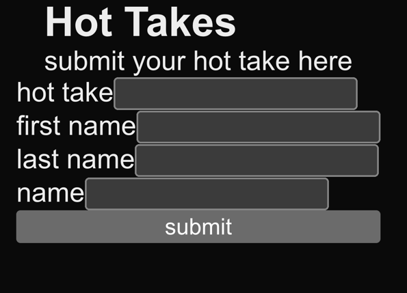
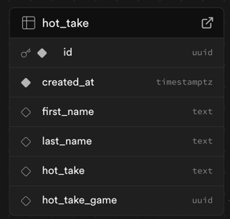

# Hot Takes


## Setup
Setup your supabase with tables and create a `.env` file at the root

### hot_take table


### .env file
```bash
SUPABASE_URL='TODO'
SUPABASE_ANON_KEY='TODO'
BASE_URL='http://localhost:3000/'
```

## Develop

First, run the development server:
```bash
npm install
npm run dev
```
