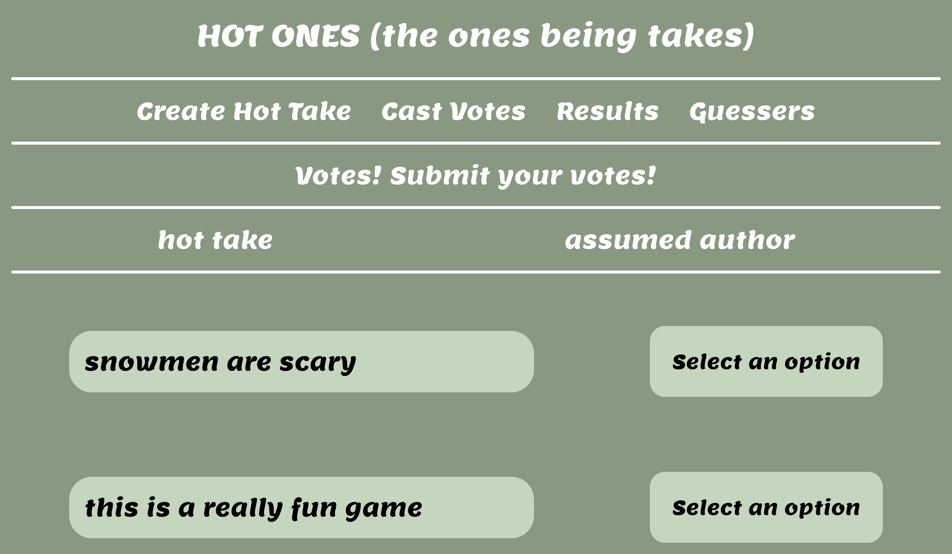
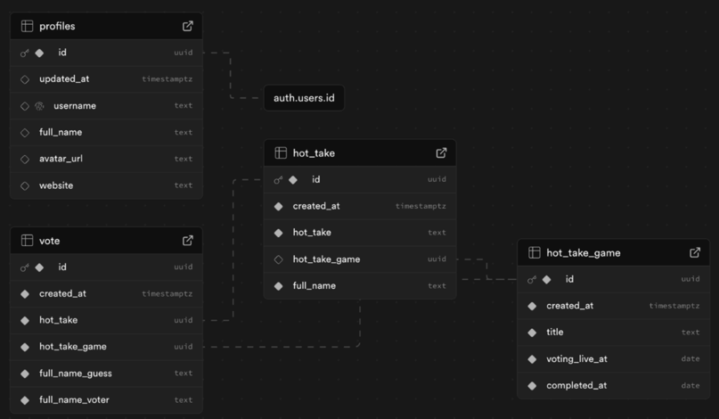

# Hot Takes



## Soft Intro and Release

Jess was inspired by the [Subway Takes by Kareem Rahma](https://www.youtube.com/@SubwayTakes) and we wanted to create something similar so our friends at the Recurse Center could play a game together and foster community.

We polled [Recuse Center](https://www.recurse.com/) attendees throughout the week to gather their hot takes through the submit page so that we could present the experience during a five minute demonstration. We accumulated 40 different hot take records leading into the demo and froze the submission page to ensure a consistent experience.

For the demonstration, we presented the hot take’s cast vote page to a crowd of 50 people virtually and in-person and had them guess which individual submitted each hot take. Finally, we revealed who said what on the results page - detailing how accurate the crowd was in guessing the hot take author and the guessers page which shows who was most accurate in guessing everyone’s hot take.

## Tech Stack Review

We utilized a tech stack of Next.JS, Vercel, Drizzle and Turso for this project. This was our first foray into using Next.JS and wanted to add in a framework that brought in both CSR (Client-Side Rendering) and SSR (Server-Side Rendering), in addition to the API Routes functionality. Vercel and Turso both allow for quick and speedy development for prototype and hobbyist projects which was perfect for the quick and easy social experience we wanted to do with everyone at the hub.

## Breakdown

The theme and general design of the project was created by Jess in [Figma](https://www.figma.com/design/aCLimfvvYabx1okaTMpPTF/Scalding-Takes?node-id=0-1&t=ruVhOlOzln1sCQM7-1). The project development was created through pair programming in which Bradley directed the implementation and creation of the backend, while Jess drove. Likewise, for the front-end, Bradley drove while Jess directed the creation. This allowed both of us to experiment on tech stacks we were inexperienced, but interested in growing into, while having the safety net of an expert in the passenger seat. The presentation preparation and delivery was executed by both individuals.

## Schema Design



## Future Developments

1. We discussed expanding the game to make it playable for multiple games, similar to a kahoot experience, by allowing individuals to create games and tracking hot takes by aligning them to their game ids. Unfortunately, we wanted to focus on getting an MVP out to our Recurse Center peers before they graduated from the program which didn’t allow this functionality in our timeline.
2. The math on the results page was implemented on the day of demos and unfortunately is not working correctly (if the 300% didn’t already give that away). We would love to fix that in the future.
3. As far as the UX/UI experience, the dropdowns showing all 40 participants is mildly overwhelming. We would either implement a scrollable or searchable dropdown list and/or recommend for individuals to have groups smaller than 20 while playing this game.

## Demo Video

This [video](https://youtu.be/XtUc0Y7qqv0) provides a quick overview showing the functionality of our application and the surrounding infrastructure supporting it.

# Develop

Create a Turso db, and an `.env` file at the root with the following contents:

```bash
TURSO_CONNECTION_URL="libsql://hot-takes-game-REDACTED.aws-us-east-1.turso.io"
TURSO_TOKEN='REDACTED'
BASE_URL='http://localhost:3000/'
```

Run the development server:

```bash
npm install
npm run dev
```

# Deploy

1. Add turso credentials to `.env` and use [drizzle kit](https://orm.drizzle.team/docs/kit-overview) to manage the db (tables created via `npx drizzle-kit generate` etc.)
2. Import [Github repo into Vercel](https://vercel.com/docs/git#deploying-a-git-repository)
3. Add credentials from `.env` to Vercel
4. Frontend and Backend are automatically deployed upon push to Github main branch
